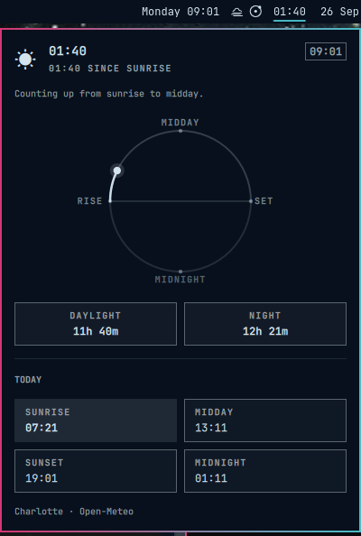

# Solar Clock

A bar clock that follows the sun, not civil hours.

It sits next to Omarchy's normal clock. It does not replace it.



## Features

- Counts **up from sunrise** until solar midday
- Counts **down to sunset** after midday
- Counts **up from sunset** until solar midnight
- Counts **down to sunrise** after midnight
- Shows `sunrise`, `mid day`, `sunset`, and `midnight` on those minutes
- Uses the same location as the Omarchy weather widget
- Sunrise and sunset come from Open-Meteo (wttr.in astronomy as fallback)
- Click the label for today's sun times, wall clock, and location
- Follows a location you set in the weather panel

## Install

```sh
omarchy plugin add https://github.com/mrdulasolutions/solar-clock.git --enable
```

That clones into
`~/.config/omarchy/plugins/io.github.mrdulasolutions.solar-clock/`
and places the widget in the center of the bar. Your existing clock stays put.

## Usage

| When | Bar shows |
| --- | --- |
| Sunrise | `sunrise` |
| After sunrise | `00:01` … counting up to midday |
| Solar noon | `mid day` |
| After midday | counting down to sunset |
| Sunset | `sunset` |
| After sunset | counting up to midnight |
| Solar midnight | `midnight` |
| After midnight | counting down to sunrise |

| Action | What it does |
| --- | --- |
| Left click | Open the detail panel |
| Middle click | Refresh location and sun times |
| Escape | Close the panel |

Hover the bar label for a tooltip such as `03:04 until sunset`.

## Location

The plugin does not guess a separate city. It uses Omarchy weather:

1. `~/.local/state/omarchy/settings/weather.json` if you have set a place
2. Otherwise the same wttr.in auto-detect the weather widget uses

Pin a place in the weather panel, or:

```sh
omarchy weather location --set "Charlotte" 35.22709,-80.84313
```

Sun times are fetched from [Open-Meteo](https://open-meteo.com/) (`daily=sunrise,sunset`).
Midday is the midpoint of today's sunrise and sunset. Midnight is the midpoint
of sunset and the next sunrise. Times refresh every six hours and at midnight.

## Configure

```sh
omarchy bar move io.github.mrdulasolutions.solar-clock --after omarchy.clock
```

The plugin does not write weather.json or overwrite user configuration.

## Remove

```sh
omarchy plugin remove io.github.mrdulasolutions.solar-clock
```

Removal deletes the plugin checkout and takes the widget off the bar.
It does not change weather location, the system clock, or other Omarchy settings.

## Dependencies

Ships with Omarchy / the network:

- `curl` and `bash` — Open-Meteo sunrise/sunset and wttr.in location
- Omarchy weather location file, when present

HTTPS bodies are capped at 256 KiB in the `fetch-https` child (`curl --max-filesize` plus `head -c`). Overflow is discarded; the shell never collects an unbounded stream.

No extra packages, sudoers rules, or install hooks.

## Development

This directory is the live plugin. Saving QML reloads it in `omarchy-shell`.

```sh
omarchy plugin validate ~/.config/omarchy/plugins/io.github.mrdulasolutions.solar-clock
omarchy-shell shell rescanPlugins
omarchy-shell io.github.mrdulasolutions.solar-clock toggle
```

| File | Role |
| --- | --- |
| `manifest.json` | Plugin contract |
| `BarWidget.qml` | Bar label |
| `Panel.qml` | Detail popup |
| `Model.js` | Location parsing and sun-phase clock |
| `fetch-https` | Bounded HTTPS GET (256 KiB, reject overflow) |

## License

[MIT](LICENSE)
